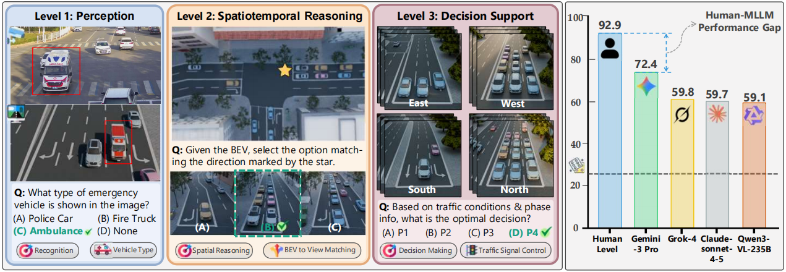
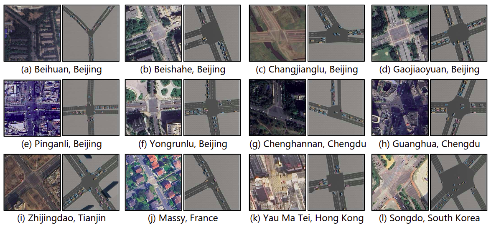
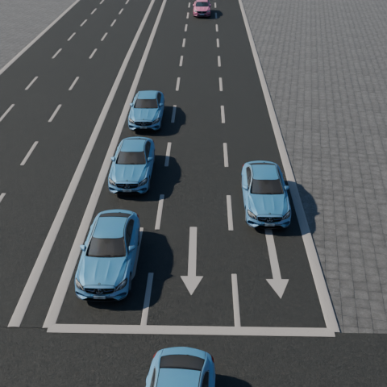
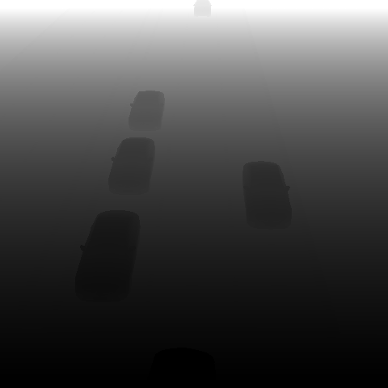
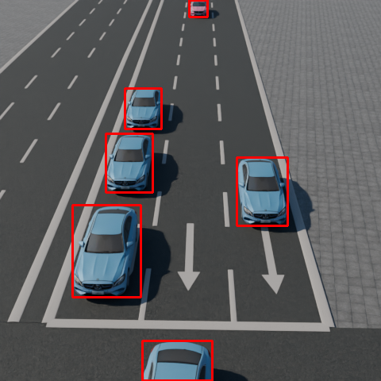

<!--
 * @Author: WANG Maonan
 * @Date: 2026-09-18 21:52:56
 * @Description: README for OmniTraffic
 * @LastEditTime: 2026-09-18 22:09:52
 * @LastEditors: WANG Maonan
-->
# OmniTraffic

[](https://arxiv.org/abs/2606.15749)
[](https://opensource.org/licenses/Apache-2.0)
[](https://www.python.org/downloads/)




Official implementation of [OmniTraffic: A Controllable Generation Pipeline and Benchmark for Spatio-Temporal Traffic Reasoning](https://arxiv.org/abs/2606.15749).

## 📌 News

- **[June 2026]** Initial preprint released on arXiv: [OmniTraffic](https://arxiv.org/abs/2606.15749).
- **[May 2026]** Dataset release: [OmniTraffic Benchmark](https://huggingface.co/datasets/CROHuang/OmniTraffic_Benchmark) and [OmniTraffic Dataset](https://huggingface.co/datasets/CROHuang/Omnitraffic_Dataset).

## 🚀 Overview

OmniTraffic is a comprehensive evaluation benchmark designed to test the multi-view spatiotemporal reasoning and Bird's-Eye View (BEV) perception capabilities of multimodal large language models (MLLMs) and autonomous driving systems.

While the complete OmniTraffic dataset ecosystem contains an underlying pool of over 8 million generated VQA samples, this repository specifically hosts the **OmniTraffic Gold-Standard Benchmark**: 3,200 highly-curated VQA pairs systematically sampled from the massive 8M pool and rigorously validated by human experts. They span twelve real-world intersections reconstructed as editable 3D environments, cover both simulated and real-world scenes, and are organized into three task levels — perception, multi-view and temporal reasoning, and decision support.

**Evaluating a model?** Download the benchmark and jump to [VQA Benchmark](#-vqa-benchmark). **Generating your own data?** The rest of the repository is the pipeline that produced the 8M pool.

### Pipeline

Each stage is a directory here, and each one's output feeds the next. `scenario_dataset/` is not tracked in git — download it, or produce it with stage 1.

```
traffic_scenarios/        12 intersections: SUMO networks, routes, Hydra presets
        ↓                 scenario_collector/collector/  — run a control policy, log the simulation
scenario_dataset/         per-timestep simulation state + annotations
        ↓                 scenario_collector/renderers/  — Blender multi-view rendering
scenario_dataset/         + high_quality_rgb / mask / depth
        ↓                 vqa_generate_pipeline/         — turn annotations into QA pairs
VQA samples               benchmark questions across 3 task levels
```

### Downloads

| Resource | Contents | Extract to | Link |
|----------|----------|-----------|------|
| OmniTraffic Dataset | Simulation data + rendered images | `scenario_dataset/` | [HuggingFace](https://huggingface.co/datasets/CROHuang/Omnitraffic_Dataset) |
| OmniTraffic Benchmark | 3,200 gold-standard VQA pairs | `vqa_generate_pipeline/` | [HuggingFace](https://huggingface.co/datasets/CROHuang/OmniTraffic_Benchmark) |
| Blender environment files | 3D traffic environments (`.blend`) | `traffic_scenarios/<MAP>/` | [GitHub Releases](https://github.com/Traffic-Alpha/OmniTraffic/releases) |
| Human validation images | 100-question study images | `human_validation/data/` | [GitHub Releases](https://github.com/Traffic-Alpha/OmniTraffic/releases/tag/v1.0-human-validation) |

---

## ⚡ Getting Started

### 1. Install

```bash
uv sync
```

Requires Python 3.12+. Per stage, you also need:

| Stage | Requirement |
|-------|-------------|
| Data collection | [SUMO](https://eclipse.dev/sumo/) and [TransSimHub](https://github.com/Traffic-Alpha/TransSimHub) (expected at `../TransSimHub/`, not vendored here) |
| 3D rendering | [Blender](https://www.blender.org/) 4.4+ and the `.blend` files from Releases |
| VQA generation only | Nothing extra — works on downloaded `scenario_dataset/` |

### 2. Get the data

The HuggingFace datasets are pre-processed and ready to use as-is: OmniTraffic_Dataset into `scenario_dataset/`, OmniTraffic_Benchmark into `vqa_generate_pipeline/`. To render your own scenarios, also fetch the Blender environment files from [Releases](https://github.com/Traffic-Alpha/OmniTraffic/releases) into `traffic_scenarios/` — they are too large for git.

### 3. Collect a scenario

```bash
MAP=Hongkong_YMT SCENE=easy_fluctuating_commuter_barrier \
    python scenario_collector/collector/rl_collector.py
```

See [Scenario Collector](#-scenario-collector) for the strategies and how `SCENE` names are built.

### 4. Render it

```bash
./scenario_collector/renderers/render_single.sh \
    --scenario ./scenario_dataset/Hongkong_YMT_easy_fluctuating_commuter_barrier/ \
    --blend ./traffic_scenarios/Hongkong_YMT/env.blend \
    --blender_path /path/to/blender \
    --start 0 --end 600 --render_mask --render_depth
```

`--blender_path` defaults to a local install path and must be overridden. Full flags: [`scenario_collector/README.md`](./scenario_collector/README.md).

### 5. Generate VQA

```bash
python vqa_generate_pipeline/simulation/generate_vqa.py
```

Reads `<timestep>/annotations/*.json` under a scenario directory and writes QA pairs to `<timestep>/QA/`.

---

## 🚦 Traffic Scenarios



Each intersection is reconstructed as an editable 3D traffic environment:

| # | Location | Description |
|---|----------|-------------|
| 1 | `Beijing_Beihuan` | Urban intersection in Beijing |
| 2 | `Beijing_Beishahe` | Residential area intersection |
| 3 | `Beijing_Changjianglu` | Commercial district intersection |
| 4 | `Beijing_Gaojiaoyuan` | Suburban intersection |
| 5 | `Beijing_Pinganli` | Central urban intersection |
| 6 | `Beijing_Yongrunlu` | High-traffic corridor |
| 7 | `Chengdu_Chenghannanlu` | Chengdu downtown intersection |
| 8 | `Chengdu_Guanghua` | Technology district intersection |
| 9 | `France_Massy` | European urban intersection |
| 10 | `Hongkong_YMT` | Hong Kong urban intersection |
| 11 | `SouthKorea_Songdo` | Korean smart city intersection |
| 12 | `Tianjin_zhijingdao` | Tianjin main road intersection |

Each intersection directory contains:

```
traffic_scenarios/<MAP>/
├── networks/               # SUMO networks: easy.net.xml, normal.net.xml
├── routes/                 # Traffic demand per profile (*.rou.xml)
├── add/                    # Detectors and additional SUMO files
├── 3d_assets/              # map.glb, ground.glb, lane_lines.glb
├── *.sumocfg               # One config per network + demand profile
├── generate_routes.py      # Regenerate demand
├── generate_tls_detectors.py
└── env.blend               # Blender environment (from Releases, not in git)
```

Shared Hydra config in `traffic_scenarios/_config/` layers the environment base, incident overlay and demand profile into one named scenario.

---

## 🎬 Scenario Collector

Runs a signal-control policy over a scenario and logs per-timestep simulation state. Full reference: [`scenario_collector/README.md`](./scenario_collector/README.md).

### Control strategies

| Script | Normal control | Special events | Purpose |
|--------|----------------|----------------|---------|
| `rl_collector.py` | RL policy | — | Pure RL baseline |
| `fixed_timing_collector.py` | Fixed timing plan | — | Traditional baseline |
| `random_collector.py` | Random phase selection | — | Random baseline |
| `rl_rule_collector.py` | RL policy | Rule-based override | RL + rule hybrid |
| `maxq_rule_collector.py` | MaxQ queueing | Rule-based override | MaxQ + rule hybrid |

Rule-based overrides handle what a policy is not trained for — emergency-vehicle preemption, lane blockage.

### Scenario naming

A run is selected by two environment variables, `MAP` and `SCENE`. `SCENE` resolves to a Hydra preset at `traffic_scenarios/_config/presets/<MAP>/<SCENE>.yaml` composing three independent axes:

```
SCENE = <network>_<demand profile>_<incident>
        easy    _ fluctuating_commuter _ barrier
```

| Axis | Values | Defined in |
|------|--------|-----------|
| **Network** | `easy`, `normal` | `networks/easy.net.xml` / `normal.net.xml` — different approach and phase counts |
| **Demand profile** | `high_density`, `low_density`, `fluctuating_commuter`, `increasing_demand`, `random_perturbation` | `*.sumocfg` + `_config/network_routes/` |
| **Incident** | `none`, `barrier`, `branch`, `crashed`, `pedestrain` | `_config/envs/<MAP>/accident/` and `special_vehicle/` |

Not every combination exists, and coverage differs per intersection (`France_Massy`, `Hongkong_YMT` and `SouthKorea_Songdo` are the most complete). Check what is available first:

```bash
ls traffic_scenarios/_config/presets/<MAP>/
```

> Some preset names use the spelling `pedestrain`. Use the filename exactly as listed.

### Usage

```bash
cd /path/to/OmniTraffic

# RL policy
MAP=Hongkong_YMT SCENE=normal_fluctuating_commuter_barrier python scenario_collector/collector/rl_collector.py

# Fixed timing
MAP=France_Massy SCENE=easy_random_perturbation_none python scenario_collector/collector/fixed_timing_collector.py

# Random policy
MAP=France_Massy SCENE=easy_random_perturbation_none python scenario_collector/collector/random_collector.py

# RL + rule hybrid
MAP=France_Massy SCENE=easy_random_perturbation_barrier python scenario_collector/collector/rl_rule_collector.py

# MaxQ + rule hybrid
MAP=Hongkong_YMT SCENE=normal_fluctuating_commuter_barrier python scenario_collector/collector/maxq_rule_collector.py
```

On hybrid graphics, prefix with `__NV_PRIME_RENDER_OFFLOAD=1 __GLX_VENDOR_LIBRARY_NAME=nvidia` to force the dGPU.

### 3D rendering

```bash
# Single scenario
./scenario_collector/renderers/render_single.sh --start 0 --end 600 --render_mask --render_depth

# Batch
./scenario_collector/renderers/render_batch.sh --scenario <path1> --scenario <path2>
```

Per timestep and camera view the renderer writes `high_quality_rgb/` (photorealistic RGB), `high_quality_mask/` (semantic segmentation) and `high_quality_depth/` (depth map); `scenario_collector/tools/yolo_detection.py` adds detection boxes from the RGB.

| RGB Rendering | Semantic Mask | Depth Map | YOLO Detection |
|:---:|:---:|:---:|:---:|
|  |  |  |  |

---

## ❓ VQA Benchmark

From the structured metadata logged by the collector — vehicle states, lane topology, signal phases — OmniTraffic generates synchronized multi-view QA pairs covering lane functions, view-BEV correspondence, temporal dynamics and signal-phase analysis.

| Level | Task | Description |
|-------|------|-------------|
| **1** | Scene Perception | Object detection, lane function recognition, signal phase identification |
| **2** | Multi-view & Temporal Reasoning | View-BEV correspondence, temporal dynamics tracking |
| **3** | Decision Support | Topology-grounded reasoning for traffic control decisions |

Answers derive from simulator ground truth rather than hand annotation, so they are exact and generation scales to the 8M+ pool; the released benchmark is the human-validated 3,200-pair subset. To regenerate QA from your own scenarios:

```bash
python vqa_generate_pipeline/simulation/generate_vqa.py
```

---

## 👥 Human Validation

A Flask web app measuring **human** performance on 100 questions sampled from the benchmark, across synthetic and real-world images — the reference point model scores are read against.

```bash
cd human_validation/web_app && uv run python app.py   # http://localhost:5000
```

Data download and scoring details: [`human_validation/README.md`](./human_validation/README.md).

---

## 📂 Repository Structure

```
OmniTraffic/
├── traffic_scenarios/           # 12 intersection environments
│   ├── <MAP>/                   # networks, routes, add, 3d_assets, *.sumocfg
│   └── _config/                 # Shared Hydra configuration
│       ├── envs/<MAP>/          # base + accident/ + special_vehicle/ overlays
│       ├── network_routes/      # Network + demand profile pairs
│       ├── presets/<MAP>/       # Composed SCENE definitions
│       └── selector.yaml        # Resolves MAP / SCENE env vars
├── scenario_collector/          # Stage 1-2: collection and rendering
│   ├── collector/               # Five control strategies
│   ├── renderers/               # Blender rendering scripts
│   └── tools/                   # YOLO detection, depth conversion, QC
├── vqa_generate_pipeline/       # Stage 3: VQA generation
│   └── simulation/              # generate_vqa.py + parse_infos/
├── human_validation/            # Human baseline study (Flask app)
├── assets/                      # README figures
├── scenario_dataset/            # Collected/downloaded data (not in git)
└── TransSimHub/                 # Simulation engine (external dependency, not in git)
```

---

## 📖 Citation

If you use OmniTraffic in your research, please cite:

```bibtex
@article{wang2026omnitraffic,
  title={OmniTraffic: A Controllable Generation Pipeline and Benchmark for Spatio-Temporal Traffic Reasoning},
  author={Wang, Maonan and Huang, Zhengyan and Jiang, Kemou and Fu, Yuhang and Zhu, Jiayue and Cai, Yuxin and Zou, Xingchen and Zhang, Qiaosheng and Yu, Yi and Wang, Ding and others},
  journal={arXiv preprint arXiv:2606.15749},
  year={2026}
}
```

## 🙏 Acknowledgements

We thank our collaborators from SenseTime and Shanghai AI Lab (in alphabetical order):
- Yuheng Kan (阚宇衡)
- Zian Ma (马子安) 
- Chengcheng Xu (徐承成) 

for their contributions to the [TransSimHub](https://github.com/Traffic-Alpha/TransSimHub) simulator development.

## 📫 Contact

If you have any questions, please open an issue in this repository. We will respond as soon as possible.
