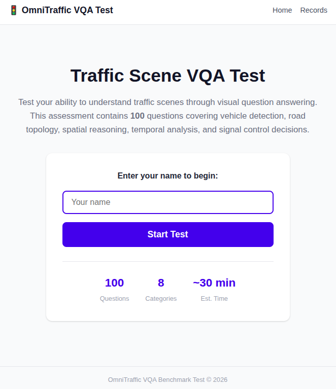
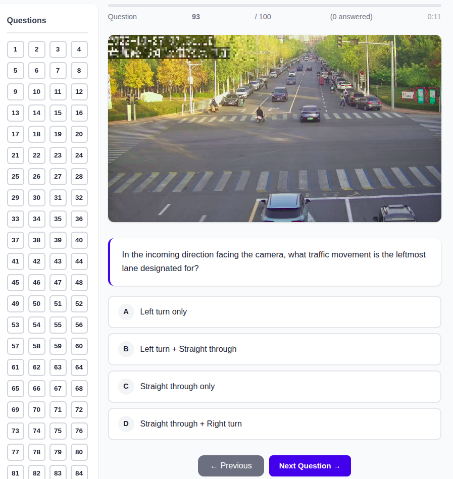
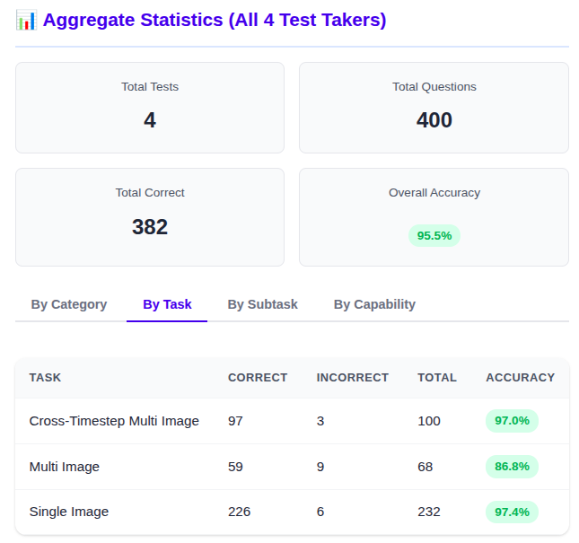

<!--
 * @Author: WANG Maonan, Zhengyan Huang
 * @Date: 2026-02-26 15:54:22
 * @Description: README
 * @LastEditTime: 2026-02-26 16:23:05
-->
# OmniTraffic 人工验证

这是 [OmniTraffic](https://github.com/your-repo/OmniTraffic) 项目中的人工验证部分——一个全面的交通场景视觉问答基准。我们从数据集中精心挑选了 **100 道题目**，涵盖**仿真环境**和**真实环境**，用于评估人类在交通场景理解任务上的表现（[English Version](README.md)）。

<div align=center>
   
</div>
<p align="center">首页 - 输入用户名开始答题</p>

## 快速开始

### 1. 下载数据

从 GitHub Release 下载图像数据并解压到 `data/images/` 目录：

```bash
# 从 GitHub Release 下载
# https://github.com/Traffic-Alpha/OmniTraffic/releases/tag/v1.0-human-validation

# 解压数据到 data/images/
unzip human_validation_data.zip -d OmniTraffic/human_validation/data/
```

解压后，验证目录结构：

```
data/images/
├── qa_dataset/           # 仿真环境图像
│   ├── Beijing_Beihuan/
│   ├── Beijing_Beishahe/
│   ├── Beijing_Changjianglu/
│   ├── Chengdu_Chenghannanlu/
│   ├── Chengdu_Guanghua/
│   ├── France_Massy_perturbation_crashed/
│   ├── SouthKorea_Songdo_perturbation_crashed/
│   └── ...
└── qa_dataset_real/     # 真实环境图像
```

### 2. 启动 Web 服务

```bash
cd OmniTraffic/human_validation/web_app
uv run python app.py
```

Web 应用将在 `http://localhost:5000` 启动。

### 3. 开始答题

1. 在浏览器中打开 `http://localhost:5000`
2. 输入用户名开始答题
3. 通过选择 A/B/C/D 选项回答全部 100 道题目
4. 提交后查看分数和详细结果

<div align=center>
   
</div>
<p align="center">答题界面 - 样题展示</p>

### 4. 查看参考答案

完成测试后可以：
- 查看得分和准确率
- 核对每道题的正确答案
- 将结果下载为 JSON 文件

<div align=center>
   
</div>
<p align="center">结果分析</p>


## 文件结构

```
human_validation/
├── web_app/
│   ├── app.py            # Flask 应用
│   ├── config.py         # 配置文件
│   ├── static/          # 静态资源
│   ├── templates/       # HTML 模板
│   └── results/         # 测试结果 (JSON 文件)
├── data/
│   ├── images/          # 交通场景图像
│   │   ├── qa_dataset/      # 仿真图像
│   │   └── qa_dataset_real/ # 真实图像
│   └── question_sample.jsonl # 精选的 100 道题目
├── README.md
└── README_zh.md
```

### 测试结果

所有测试结果保存在 `web_app/results/` 目录下，JSON 文件命名格式为：
```
{用户名}_{时间戳}.json
```

每个结果文件包含：
- 用户名和时间戳
- 总题数和正确数
- 按类别、任务、能力分类的准确率
