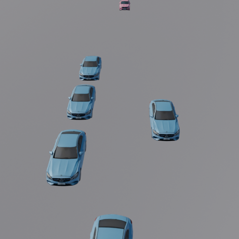

<!--
 * @Author: WANG Maonan
 * @Date: 2026-03-02 19:47:59
 * @Description: 
 * @LastEditTime: 2026-03-04 19:55:31
-->
# Scenario Collector

交通场景数据收集与渲染工具箱。用于收集不同控制策略下的交通场景数据，并通过 Blender 进行 3D 渲染。

## 项目概述

该模块实现了一个完整的场景数据收集和渲染流程：
1. **数据收集**：使用不同控制策略（RL、固定配时、随机、混合策略）收集交通仿真数据
2. **3D 渲染**：使用 Blender 将仿真数据渲染为逼真的交通场景图像

## 目录结构

```
scenario_collector/
├── README.md                      # 本文档
├── collector/                     # 数据收集模块（核心）
│   ├── rl_collector.py            # 纯RL策略收集
│   ├── fixed_timing_collector.py  # 固定配时策略收集
│   ├── random_collector.py        # 随机策略收集
│   ├── rl_rule_collector.py       # RL+规则混合策略收集
│   ├── maxq_rule_collector.py     # MaxQ+规则混合策略收集
│   ├── utils/                     # 工具函数
│   │   ├── save_vector.py
│   │   ├── env_utils/             # 环境相关工具
│   │   │   ├── make_env.py
│   │   │   ├── tsc_wrapper.py
│   │   │   └── tsc_env3d.py
│   │   └── rl_utils/              # RL相关工具
│   │       └── simple_int.py
│   └── parse_infos/               # 专家决策解析
│       ├── get_expert_action.py
│       └── get_expert_action_maxq.py
├── renderers/                      # 渲染脚本
│   ├── render_scene.py            # Blender渲染脚本
│   ├── render_single.sh           # 单场景渲染
│   └── render_batch.sh            # 批量渲染
├── tools/                         # 其他工具
│   ├── yolo_detection.py          # YOLO目标检测
│   ├── depth_to_gray.py          # 深度图处理
│   └── corrupted_images.py        # 损坏图像处理
└── yolo11x.pt                     # YOLO模型权重
```

## 策略对比

| 脚本 | 常规策略 | 特殊情况 | 用途 |
|------|---------|---------|------|
| `rl_collector` | RL模型 | 无 | 纯RL基线对比 |
| `fixed_timing_collector` | 固定配时 | 无 | 固定配时基线对比 |
| `random_collector` | 随机 | 无 | 随机基线对比 |
| `rl_rule_collector` | RL模型 | 规则(紧急车辆/路障) | RL+规则混合 |
| `maxq_rule_collector` | MaxQ排队 | 规则 | 最大排队+规则 |

## 使用流程

### 第一步：数据收集

```bash
# 切换到项目根目录
cd /path/to/OmniTraffic

# 使用 RL 策略收集数据
python scenario_collector/collector/rl_collector.py

# 使用固定配时策略收集数据
MAP=France_Massy SCENE=easy_high_density_barrier python scenario_collector/collector/fixed_timing_collector.py

# 使用随机策略收集数据
MAP=France_Massy SCENE=easy_high_density_barrier python scenario_collector/collector/random_collector.py

# 使用 RL+规则混合策略收集数据
MAP=France_Massy SCENE=easy_random_perturbation_barrier python scenario_collector/collector/rl_rule_collector.py

# 使用 MaxQ+规则混合策略收集数据
MAP=Hongkong_YMT SCENE=normal_fluctuating_commuter_barrier python scenario_collector/collector/maxq_rule_collector.py
```

如果电脑包含集成显卡和独立显卡，可以使用下面方式指定渲染：

```
__NV_PRIME_RENDER_OFFLOAD=1 __GLX_VENDOR_LIBRARY_NAME=nvidia MAP=Hongkong_YMT SCENE=normal_fluctuating_commuter_barrier uv run python maxq_rule_collector.py
```

### 第二步：3D 渲染

使用 Blender 将收集的场景数据渲染为高质量的 3D 图像。提供两个脚本：`render_single.sh`（单场景渲染）和 `render_batch.sh`（批量渲染）。

#### 2.1 单场景渲染 (`render_single.sh`)

用于渲染单个场景的所有时间步。

**基本用法：**

```bash
# 使用默认参数渲染
./scenario_collector/renderers/render_single.sh

# 自定义时间范围渲染
./scenario_collector/renderers/render_single.sh --start 100 --end 200

# 启用 mask 和 depth 渲染
./scenario_collector/renderers/render_single.sh \
    --start 0 --end 600 \
    --render_mask --render_depth
```

**完整参数列表：**

| 参数 | 类型 | 默认值 | 说明 |
|------|------|--------|------|
| `--start` | int | 400 | 起始时间步 |
| `--end` | int | 405 | 结束时间步 |
| `--resolution` | int | 480 | 输出图像分辨率（像素） |
| `--models` | string | `high_poly` | 车辆模型精度：`high_poly` 或 `low_poly` |
| `--blend` | path | 见下方 | Blender场景文件路径 |
| `--scenario` | path | 见下方 | 场景数据存储路径 |
| `--tshub` | path | `../TransSimHub/` | TransSimHub 根目录 |
| `--blender_path` | path | 见下方 | Blender 可执行文件路径 |
| `--render_mask` | flag | false | 是否渲染 mask（语义分割掩码） |
| `--render_depth` | flag | false | 是否渲染 depth（深度图） |

**默认路径配置：**
- Blend文件：`../traffic_scenarios/Hongkong_YMT/env.blend`
- 场景数据：`../scenario_dataset/Hongkong_YMT_normal_fluctuating_commuter_barrier/`
- Blender路径：`/home/wmn/blender-4.4.3-linux-x64/blender`

**完整参数示例：**

```bash
./scenario_collector/renderers/render_single.sh \
    --scenario ../scenario_dataset/France_Massy_easy_random_perturbation_crashed/ \
    --blend ../traffic_scenarios/France_Massy/env_buildings.blend \
    --tshub ../TransSimHub/ \
    --blender_path /usr/local/blender/blender \
    --start 0 --end 300 \
    --resolution 720 \
    --models high_poly \
    --render_mask \
    --render_depth
```

#### 2.2 批量渲染 (`render_batch.sh`)

用于批量渲染多个场景，所有参数会统一应用到每个场景。

**基本用法：**

```bash
# 使用默认场景列表渲染
./scenario_collector/renderers/render_batch.sh

# 指定自定义场景进行批量渲染
./scenario_collector/renderers/render_batch.sh \
    --scenario ../scenario_dataset/scene1 \
    --scenario ../scenario_dataset/scene2 \
    --scenario ../scenario_dataset/scene3
```

**参数说明：**

除了 `render_single.sh` 的所有参数外，还支持：

| 参数 | 类型 | 说明 |
|------|------|------|
| `--scenario` | path | 场景路径（可多次指定，添加多个场景） |

**默认场景列表：**
1. `Hongkong_YMT_normal_fluctuating_commuter_barrier`
2. `Hongkong_YMT_normal_fluctuating_commuter_none`

**批量渲染示例：**

```bash
# 方案1：使用默认场景，自定义渲染参数
./scenario_collector/renderers/render_batch.sh \
    --start 0 --end 600 \
    --resolution 1080 \
    --models high_poly \
    --render_mask --render_depth

# 方案2：指定多个自定义场景
./scenario_collector/renderers/render_batch.sh \
    --scenario ../scenario_dataset/France_Massy_scene1 \
    --scenario ../scenario_dataset/France_Massy_scene2 \
    --start 100 --end 500 \
    --models low_poly

# 方案3：完整参数配置
./scenario_collector/renderers/render_batch.sh \
    --blender_path /opt/blender/blender \
    --blend ../traffic_scenarios/custom_scene.blend \
    --tshub ../TransSimHub/ \
    --scenario ../scenario_dataset/scene1 \
    --scenario ../scenario_dataset/scene2 \
    --start 0 --end 300 \
    --resolution 720 \
    --models high_poly \
    --render_mask --render_depth
```

**查看帮助信息：**

```bash
# 任意脚本传入未知参数会显示帮助
./scenario_collector/renderers/render_batch.sh --help
```

#### 2.3 渲染输出说明

渲染完成后，每个时间步会在场景目录下生成以下文件：

```
scenario_dataset/Hongkong_YMT_xxx/
├── 0/                          # 时间步 0
│   ├── 3d_vehs.json           # 车辆3D信息（输入）
│   ├── high_quality_rgb/      # RGB渲染结果
│   │   ├── 0.png              # 视角0
│   │   ├── 1.png              # 视角1
│   │   └── ...
│   ├── high_quality_mask/     # Mask渲染结果（如启用）
│   │   ├── 0.png
│   │   └── ...
│   └── high_quality_depth/    # Depth渲染结果（如启用）
│       ├── 0.png
│       └── ...
├── 1/                          # 时间步 1
└── ...
```

#### 2.4 渲染参数建议

| 场景类型 | 建议配置 | 说明 |
|---------|---------|------|
| **快速预览** | `--models low_poly --resolution 480` | 使用低精度模型，快速查看效果 |
| **标准渲染** | `--models high_poly --resolution 720` | 高质量模型，适合大多数场景 |
| **高质量渲染** | `--models high_poly --resolution 1080` | 最高质量，用于展示或论文 |
| **分割训练** | `--render_mask` | 生成语义分割掩码 |
| **深度估计** | `--render_depth` | 生成深度图用于深度学习 |
| **完整数据集** | `--render_mask --render_depth` | 同时生成所有数据类型 |

#### 2.5 渲染结果示例

以下是渲染系统生成的不同类型数据示例：

<table>
  <tr>
    <td align="center"><b>RGB 渲染</b></td>
    <td align="center"><b>语义分割掩码</b></td>
  </tr>
  <tr>
    <td></td>
    <td></td>
  </tr>
  <tr>
    <td align="center">高质量的真实感道路场景渲染</td>
    <td align="center">车辆分割掩码（用于语义分割任务）</td>
  </tr>
  <tr>
    <td align="center"><b>深度图</b></td>
    <td align="center"><b>YOLO 检测结果</b></td>
  </tr>
  <tr>
    <td></td>
    <td></td>
  </tr>
  <tr>
    <td align="center">场景深度信息（用于深度估计任务）</td>
    <td align="center">目标检测框标注（使用YOLOv11）</td>
  </tr>
</table>

**数据类型说明：**
- **RGB图像**：逼真的3D交通场景渲染，可用于视觉感知、场景理解等任务
- **Mask掩码**：精确的语义分割标注，背景为灰色，车辆为彩色，可用于实例分割和语义分割训练
- **Depth深度图**：场景的深度信息，越暗表示距离越远，可用于深度估计和3D重建
- **YOLO检测**：自动标注的车辆检测框，可用于目标检测模型的训练和验证

#### 2.6 注意事项

1. **Blender路径**：首次使用需要根据实际安装路径修改 `--blender_path` 参数
2. **内存占用**：`high_poly` 模型渲染会占用较多内存，建议至少 16GB RAM
3. **渲染时间**：每个时间步渲染时间约 1-3 分钟（取决于车辆数量和模型精度）
4. **批量渲染**：批量渲染时所有场景使用相同参数，如需不同配置请分别调用 `render_single.sh`
5. **中断恢复**：如果渲染中断，可以使用 `--start` 参数从断点继续渲染

